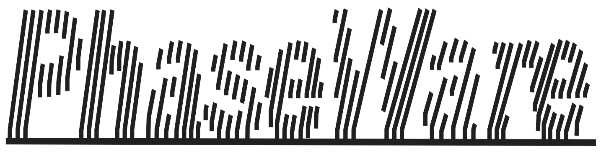

*Phase map retrieval for fringe projection profilometry and off-axis digital holographic interferometry*

Developed by Lawson Optics Lab, Imaging Program, Lawson Health Research Institute, London, ON, Canada

Non-contact optical surface measurement and movement tracking techniques have many applications but can be difficult to implement due to the complex software involved. We introduce a MATLAB-based graphical application that performs phase map retrieval for fringe projection profilometry and off-axis digital holographic interferometry. Designed with a pipeline-based architecture, PhaseWare assembles the most commonly used techniques and includes pre-processing (cropping, DC offset removal, filtering); fringe and phase extraction (hologram reconstruction, phase demodulation); and post-processing (denoising, masking, phase unwrapping, background removal, image enhancement). 

Keywords: phase retrieval, 3D surface imaging, fringe projection profilometry, off-axis digital holographic interferometry

